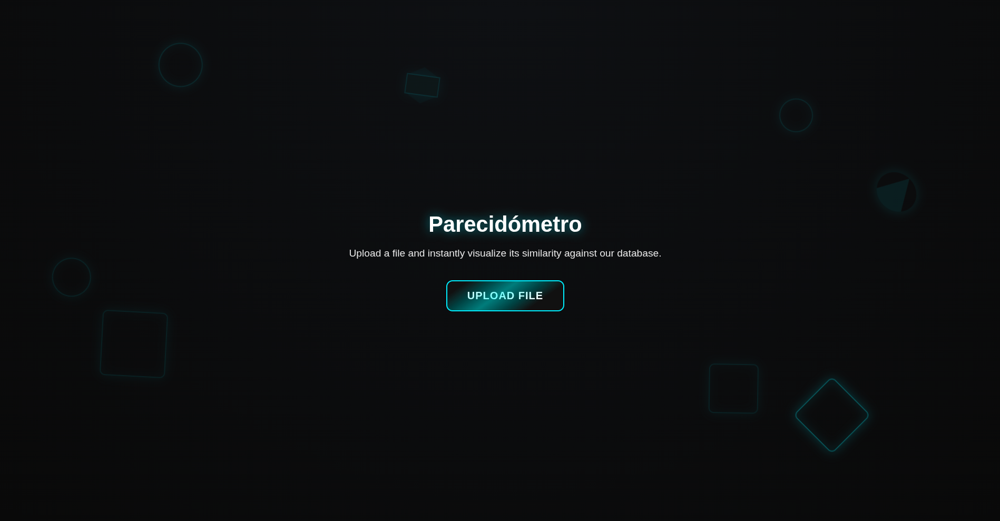

# **Parecidómetro** – Detección de similitud entre ficheros
```
  _____                    _     _                      _             
 |  __ \                  (_)   | |                    | |            
 | |__) |_ _ _ __ ___  ___ _  __| | ___  _ __ ___   ___| |_ _ __ ___  
 |  ___/ _` | '__/ _ \/ __| |/ _` |/ _ \| '_ ` _ \ / _ \ __| '__/ _ \ 
 | |  | (_| | | |  __/ (__| | (_| | (_) | | | | | |  __/ |_| | | (_) |
 |_|   \__,_|_|  \___|\___|_|\__,_|\___/|_| |_| |_|\___|\__|_|  \___/ 
```
Parecidómetro es una herramienta diseñada para **analizar ficheros y detectar similitudes entre ellos** utilizando *hashes de similitud aproximada*, una técnica ampliamente utilizada en análisis de malware, forense digital y respuesta ante incidentes.

A diferencia de los hashes tradicionales (como SHA-256 o MD5), que cambian por completo ante la mínima modificación, los *hashes de similitud permiten medir “cuán parecido es un fichero a otro”*, incluso aunque hayan sido recompilados, alterados o ligeramente modificados.

Esta herramienta proporciona un **servicio sencillo pero potente** para almacenar y comparar ficheros, facilitando la identificación de variantes maliciosas y patrones ocultos usados por actores de cibercrimen.

# **¿Para qué sirve esta herramienta?**

Parecidómetro permite:

- Calcular múltiples hashes de un fichero, tanto tradicionales (SHA256, MD5) como de similitud (TLSH, ssdeep).
- Detectar si un fichero ya existe en la base de datos y actualizar su metainformación.
- Construir una base de datos local con información relevante (metadatos) de cada fichero.
- Facilitar el trabajo de analistas de malware, equipos DFIR, CERTs/CSIRTs y fuerzas de seguridad.

Es, en esencia, un **motor de correlación de ficheros**, que permite descubrir conexiones que los hashes normales no son capaces de detectar.

# **¿Qué aporta? ¿Por qué es útil?**

Esta herramienta sirve para **analizar y comparar ficheros utilizando técnicas de similarity hashing**, lo que permite identificar cuándo dos archivos son similares, incluso aunque hayan sido modificados, recompilados o alterados ligeramente.

Su propósito principal es **descubrir relaciones entre ficheros que los hashes tradicionales no pueden detectar**, facilitando el análisis, la clasificación y la correlación de artefactos en escenarios de ciberseguridad.

Por tanto, esta herramienta puede ayudar en casos como:
 * Detectección de variantes de malware
 * Ayudar a los equipos de respuesta a incidentes (DFIR)
 * Detectar reutilización de código, modificaciones sospechosas o binarios alterados.

# **¿Qué es un hash de similitud?**

Un hash de similitud es una técnica que permite comparar ficheros por su parecido, no por igualdad exacta.
A diferencia de SHA-256, que cambia completamente si alteramos un solo byte, algoritmos como SSDEEP o TLSH pueden detectar cuando dos archivos son esencialmente la misma cosa, aunque hayan sido modificados.
Esto es fundamental para detectar variantes de malware, analizar campañas, correlacionar artefactos forenses y comprender la evolución de amenazas en ciberseguridad.

<details>
  <summary>Más información acerca de hashes de similitud</summary>
  
Un **hash de similitud** (*similarity hash*) es una representación de un fichero diseñada para que **archivos parecidos generen hashes también parecidos**.

Esto contrasta con un hash criptográfico como SHA-256:

| Si modificas 1 byte… | Resultado                                   |
| -------------------- | ------------------------------------------- |
| SHA-256              | → cambia completamente                      |
| SSDEEP, TLSH         | → cambia ligeramente pero conserva relación |

### Ejemplo conceptual

* Tienes un malware *m1.exe*.
* El atacante recompila una versión *m1_modified.exe* cambiando un comentario o una cadena.

**SHA-256 dirá:** “Son completamente diferentes.”
**TLSH o SSDEEP dirán:** “Se parecen al 98%.”

Eso permite:

* detectar variantes,
* agrupar familias,
* correlacionar campañas,
* evitar evasiones sencillas.

Los algoritmos que usamos:

### **TLSH (Trend Micro Locality Sensitive Hash)**

Genera un hash robusto para identificar similitud entre binarios. Muy usado en análisis de malware.

### **ssdeep**

Divide el fichero en bloques y genera un hash sensible a cambios. Excelente para documentos, scripts, PDF, y binarios medianos.
  
</details>

# **Cómo usar Parecidómetro**

## Despliegue
Para desplegar la aplicación es necesario primero instalar las dependencias. Para ello:
```
$ pip install -r requirements.txt
```
Acto seguido, se debe usar flask para levantar el servicio web. Desde el directorio raíz del repositorio:
```
$ flask run
```
Esto levantará el servicio por defecto en el puerto 5000. (localhost:5000 o 127.0.0.1:5000)


## Generar base de datos
Para generar una base de datos nueva (fichero `file_db.json`) se debe usar el script [`json_parser.py`](./db/json_parser.py). Para ello, se debe lanzar el script y pasar como parámetro el directorio donde se encuentran los ficheros que compondrán la nueva base de datos. Por ejemplo:
```
$ python3 db/json_parser.py test_files/
```

Este comando procesa todos los ficheros del directorio `test_files` y genera un nuevo `file_db.json` en el directorio desde el que se ha lanzado.

# **Cómo funciona**
Una vez que se genera una base de datos contra la que comparar los ficheros que se suban al servicio, el flujo de trabajo es el siguiente:

1. Cuando la aplicación recibe el fichero, se genera su SHA256 (hash tradicional) y se comprueba si ya existe en la base de datos.
2. Si existe, se devuelve la información de este fichero pues la coincidencia es del 100%.
3. Si no existe, se calculan sus hashes de similitud TLSH y ssdeep.
4. Estos hashes de similitud son comparados con los hashes de similitud de la base de datos.
5. Si el fichero que se está buscando es similar (en base al cálculo de similitud de los hashes) a uno o más ficheros de la base de datos, se muestran hasta los cinco más similares por cada hash.
6. La información del nuevo fichero es incorporada en la base de datos.

# **Contenido del repositorio**
- [`db`](./db): Script Python para generar base de datos y fichero .JSON a modo de ejemplo de base de datos.
- [`managers`](./managers): Código utilizado por la aplicación principal para el análisis de ficheros y cálculo / comparación de hashes
- [`static`](./static) y [`templates`](./templates): Ficheros relacionados con la interfaz web (*front end*).
- [`test_files`](./test_files): Ficheros de prueba para verificar el comportamiento de Pareciómetro.
- [`doc`](./doc): Documentación para desarrolladores.
- [`app.py`](./appy.py): Entry point de la herramienta.


# **Estructura de la base de datos**

Cada entrada se organiza así:

```json
{
  "SHA256": {
    "name": ["file1", "file2"],
    "size": 12400,
    "file_type": "application/pdf",
    "first_upload_date": "",
    "last_upload_date": "",
    "desc": "",
    "hashes": {
      "sha256": "",
      "md5": "",
      "tlsh": "",
      "ssdeep": ""
    }
  }
}
```
# Imágenes de la aplicación




# Autores 
- [Alain "Str1ien" Villagrasa](https://github.com/Str1ien)
- [Daniel "Kifixo" Huici](https://github.com/danielhuici)
- [Razvan "Razvi" Raducu](https://github.com/RazviOverflow)

Este proyecto se ha desarrollado durante el [Hackathon Cyber Arena](https://eupt.unizar.es/noticia/hackaton-de-incibe) organizado como parte del Proyecto Estratégico C077.23 de INCIBE, desarrollado junto a la Universidad de Zaragoza y financiado por los fondos Next Generation EU.
